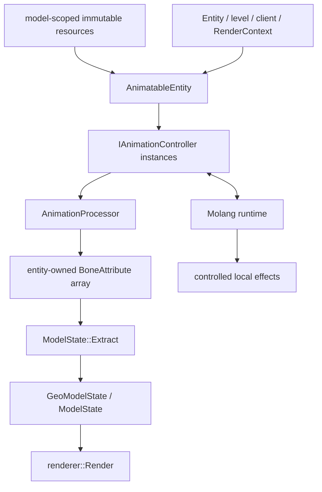

# 动画架构

本主题描述当前客户端动画运行时的逻辑结构。顶层目标见[动画系统](../../concepts/animation.md)；动画与 controller 的公开数据由 [Model Schema](../../standards/model-schema/assets-and-validation.md) 定义。解析结果、controller 状态、Molang 内存和 `BoneAttribute` 都是进程内状态。

## 责任边界

| 参与方 | 当前职责 | 不拥有 |
|---|---|---|
| 模型运行资源 | 保存已解析的 animation、controller、用户函数和骨骼绑定；随 render target 生命周期共享 | 任一 `entity` 的播放进度或变量内存 |
| 分散的输入与兼容适配 | 投影 `Entity`、`level`、`Minecraft`、`RenderContext` 和可选模组状态 | controller 状态机和 renderer 资源 |
| `AnimatableEntity` | 每客户端 `Entity` 的动画生命周期根；持有当前 `AnimatedGeoModel`、controller、processor、Molang/物理状态和输出槽 | 共享模型资源与 native 几何所有权 |
| `EntityModelBinding` | 持有 render-target 资源，协调异步取得、fallback 与资源替换 | 动画求值与共享资源内部布局 |
| `IAnimationController` | 由 coded、Bedrock 或 hybrid 实现选择状态与 animation，推进 player、转换和混合 | 跨 controller 的最终骨骼合成 |
| `AnimationProcessor` | 调度 controller，合并通道，处理复位并提交 `BoneAttribute` | 层级矩阵、面剔除与顶点生成 |
| Molang Parser / Evaluator | 解析表达式，管理作用域，并在求值阶段产生数值、状态动作或受控副作用 | 外部授权与资源所有权 |
| native renderer | 通过 `ModelState::Extract` 形成层级状态与 locator，再由 `renderer::Render` 输出顶点 | animation、controller、Molang 与 Roaming 语义 |

## 数据流

模型级资源可以被多个 `entity` 借用；controller 进度、Molang 变量、随机、物理状态和 `BoneAttribute` 数组均按 `entity` 隔离。`RenderContext` 不拥有另一套 controller 状态机：兼容 pass 可以复用 canonical `GeoModelState`，需要不同动画语义时则重新求值并 Extract 到另一输出槽。

## 核心不变量

- 动画求值发生在 Java；native 只消费已完成的骨骼结果，不回读 `Entity` 或执行脚本。
- 每个 `entity` 的动画更新、模型切换和释放必须串行；共享模型资源由显式 owner 保活。
- 短键和脚本变量只用于动画求值，不能承担模型身份、授权或资源命中语义。
- 外部输入必须先归一为有界快照，不能把可变对象直接交给异步求值。
- 可复用 pose 与本次 draw metadata 必须独立刷新。

当前实现尚未完全满足统一输入快照、副作用提交和 `RenderContext` 隔离等边界，见[动画已知问题](../../status/known-issues/animation.md)。

## 子主题

- [`AnimatableEntity` 与帧状态](entity-and-frame-state.md)：所有权、生命周期、时间、`RenderContext` 与并发。
- [Controller 与播放](controllers-and-playback.md)：coded、Bedrock、hybrid、状态机、混合与覆盖顺序。
- [Processor 与骨骼输出](processor-and-bone-output.md)：通道合成、复位、`BoneAttribute` 和 native 交接。
- [Molang 运行时](molang-runtime.md)：解析、作用域、求值阶段和副作用边界。
- [模组动画联动](../../future/mod-animation-integration.md)：尚未收敛的适配边界与验收条件。
