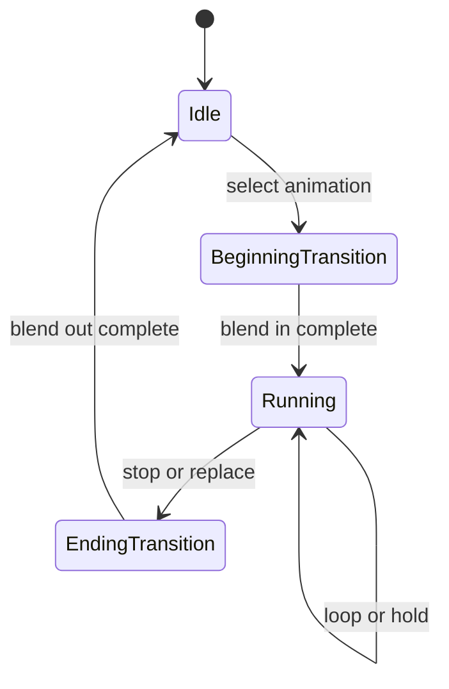
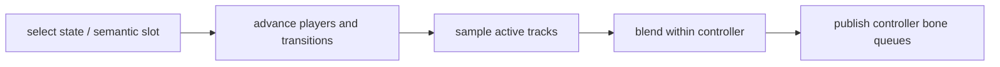

# Controller 与播放

`IAnimationController` 把语义状态映射为一个或多个 animation player，并管理进入、运行、退出、转换与混合。当前存在三种组合方式：

| 类型 | 职责 |
|---|---|
| `CodedAnimationController` | 用客户端实体语义选择内建动作，适合作为基础移动、姿态和交互行为 |
| `BedrockAnimationController` | 执行模型声明的状态、transition、条件 animation、嵌套 controller 和进入/退出动作 |
| `HybridAnimationController` | 允许模型 controller 覆盖某个语义槽，未覆盖时委托给 coded controller |

Hybrid 只改变动作来源，不改变最终 processor、Molang 作用域或骨骼输出契约。

## 播放状态

Player 支持循环、单次播放和保持末帧。选择与当前相同的 animation 不会隐式重启；显式 reload 或状态重置才重建时间线。目标 animation 不存在时回到 idle，不以随机 fallback 掩盖资源错误；render target 不可用时由调用方处理。Coded controller 还可返回继续、暂停或停止，用于区分推进时间、保持当前值和结束播放。

## Bedrock 状态机

- 从声明的 default state 开始；每次按声明顺序检查 transition，第一个成立者获胜。
- 一个 state 可以按条件激活多个 animation，结果进入同一 controller 的混合流程。
- 空 state 可以继续跳转，但必须检测环路，避免单次更新无限迁移。
- State 可以引用子 controller；嵌套仍服从同一实体时间线、Molang 上下文与副作用门禁。
- On-entry、on-exit 与 instruction keyframe 是动作阶段，不属于连续骨骼采样；重复求值不能无条件重复触发。

Animation 和 controller 的名称、引用、时间单位与 wire 约束见 [Model Schema](../../standards/model-schema/assets-and-validation.md)，本页不复制字段结构。

## 单个 controller 的求值

`AnimationPlayer` 按播放模式、当前时间和 transition 权重采样 rotation、position 与 scale；关键帧 easing 和 Molang 分量在该 player 的上下文中求值。单 controller 的结果形成 bone queue，跨 controller 的顺序、覆盖与复位由 [`AnimationProcessor`](processor-and-bone-output.md) 负责。

## 副作用阶段

主时间线推进可以触发 instruction keyframe；为其他 `RenderContext` 重算姿态时只应采样，不能重复发送同步、声音或粒子。State transition 的进入/退出动作只在真实状态改变时产生一次副作用；当前偏差见[动画已知问题](../../status/known-issues/animation.md)。
