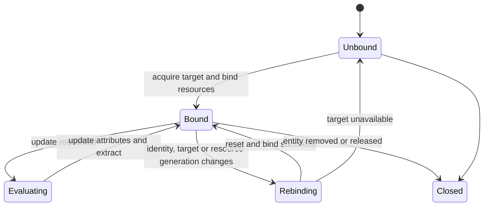

# `AnimatableEntity` 与帧状态

`AnimatableEntity` 是客户端 `Entity` 的动画生命周期根，不是外部 DTO，也不是 native model。它把共享模型资源绑定到一个 `entity`，串联输入、controller、Molang、processor 与渲染输出。

## 实体级所有权

| 状态 | 生命周期与用途 |
|---|---|
| 模型绑定 | `EntityModelBinding` 指向当前 render target，并保证解析资源、烘焙几何和纹理在使用期间存活 |
| controller 集合与时间线 | 保存各 controller / player 的状态、播放进度、转换和上次逻辑时间 |
| `AnimationProcessor` | 保存骨骼 snapshot、active bone 与通道复位状态，并写入模型拥有的 `BoneAttribute` |
| Molang 状态 | 保存 `variable` 内存、Roaming 视图、随机/物理上下文及待执行动作 |
| `Entity` 输入状态 | 跟踪 tick、移动、`Pose` 和标准化投影，用于计算连续输入 |
| 输出槽 | 保存 canonical 或按 `RenderContext` 分区的 mutable `GeoModelState`、pose / normal buffer 和 Java locator 映射 |

模型 animation、controller 和用户函数是 render target 级只读资源，可跨 `entity` 共享；上表中的可变状态不得跨 `entity` 共享。每个 `AnimatedGeoModel` 只有一份 `BoneAttribute` 数组；Extract 临时读取它，成功后的 `ModelState` 共享持有 `BakedModel`，并只长期借用对应 `GeoModelState` 的 pose buffer。

## 绑定与切换

同一 render target 内的纹理或兼容变体可通过 `AnimatedGeoModel.setModelInplace(...)` 保留 controller、Molang、Roaming、物理与时间线，并在等待既有任务后替换渲染资源。模型身份、target 或资源代次改变时，旧任务和输出先失效，再重建骨骼绑定并重置实体动画状态。是否保留必须由资源兼容性决定，不能只凭用户路径或短 hash 推断。

## 时间与更新频率

动画使用单调逻辑时间；观察到时间倒退时夹紧而不反向推进 controller。常规 `level` 中的 `entity` 可按可见性、距离和负载降低更新频率，但每次求值仍以累计逻辑时间推进，不能把跳帧误作暂停。需要即时交互或不同姿态语义的 `RenderContext` 走同步更新。

`AnimationParallelTicker` 会在正式 draw 前预调度符合条件的 `level` entity。`AnimationEvent` 携带 `partialTick`、`RenderContext` 和 `entity` 动画数据，但不会冻结查询所读的全部对象。每个 `entity` 同一时刻只允许一个动画任务；渲染消费、换模和释放都必须等待该任务完成。

## Canonical 与 mutable 输出

| 输出 | 用途 | 规则 |
|---|---|---|
| canonical | 常规 `level` 状态；可供同一逻辑帧中语义兼容的 pass 复用 | 异步或同步产生，完成后只读 |
| mutable 输出 | 需要不同动画语义的 `RenderContext` | 重新求值并 Extract 到另一 `GeoModelState`，不覆盖 canonical 槽 |
| draw metadata | 当前 pass 的矩阵、光照、相机和 `RenderContext` | 每次 draw 刷新，不随 pose 复用 |

Controller、Molang 与 `BoneAttribute` 仍是 `entity` 级共享状态；不同输出槽隔离的是 Extract 结果，不是两套独立动画历史。需要独立播放进度时应建立独立 `AnimatableEntity`，不能把输出槽当作 controller 副本。具体 `RenderContext` 路径和 Extract 位置见[逐帧状态与调度](../rendering/frame-execution.md)。

## 输入与副作用边界

异步路径应在安全阶段采样不可变输入，在纯求值后统一提交副作用；当前偏差见[动画已知问题](../../status/known-issues/animation.md)。

骨骼结果到 native 的借用、失败失效和 render 串行要求见[Processor 与骨骼输出](processor-and-bone-output.md)及[逐帧状态与调度](../rendering/frame-execution.md)。
