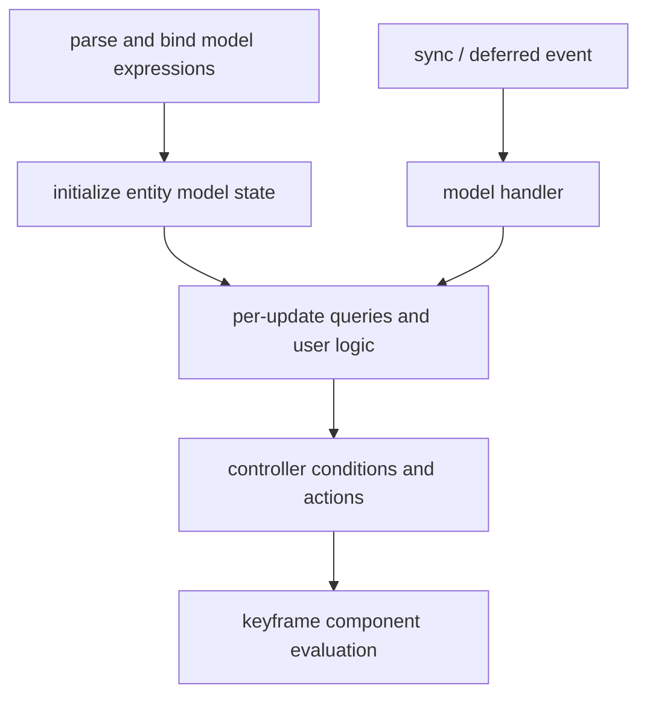

# Molang 运行时

Molang 为 animation 轨道、controller 条件和模型用户函数提供表达式运行时。Parser 在模型加载或绑定阶段把文本转换为可复用表达式；Evaluator 在实体更新、player 采样和事件处理阶段以当前作用域求值。解析失败会记录诊断并退化为常量零，使单个表达式不阻断整个模型加载。

## 作用域

| 名称空间 | 生命周期与用途 |
|---|---|
| `variable` / `v` | 实体在当前模型绑定期间持久保存的可写内存，可跨帧和 controller 使用 |
| `temp` / `t` | 当前函数或表达式调用的临时变量，不跨调用保留 |
| `context` / `c` | 每个 `AnimationPlayer` 的采样时间与任意上下文变量 |
| `query` / `q` | 从 `Entity`、`level`、`Minecraft` 或适配输入读取事实 |
| `ctrl` | 读取当前 controller 与 player 的状态和完成语义 |
| `ysm` | YSM 扩展查询与动作入口 |
| `v.roaming` | 当前模型分组下由 PlayerState 同步的持久 float 结构 |

普通 `v` 内存与 `v.roaming` 都是实体运行时变量区域；两者都不是模型身份、权限记录或骨骼输出。

## 求值阶段

- 初始化阶段重置实体级 `MolangMemory`，建立用户函数环境并执行模型 init handler；模型重绑会重建该环境。
- 更新阶段读取本次实体与客户端输入，为 controller 和轨道采样准备状态。
- Controller 阶段计算 transition、条件 animation 及进入/退出动作。
- 采样阶段为 active player 计算关键帧分量，只返回数值结果。
- `sync` 事件进入 processor 的 Molang task 队列，并在当前模型绑定下执行对应 handler。
- `defer` 保存在当前 `AnimationContext`，在 context reset 时按逆序直接调用 deferred handler。

## 数值求值与副作用

查询、算术和轨道采样应当可重复；声音、粒子和 deferred action 等属于副作用。运行时以 `allowEmitting` 区分“主时间线推进”与“为其他 `RenderContext` 重算姿态”：只有允许发射的阶段才能提交副作用，instruction keyframe 也只应随主推进触发。Transition 的进入/退出动作在真实状态改变时显式允许发射。

## 失败与信任边界

模型表达式属于不可信输入，必须限制执行预算与外部动作，并把异常隔离在当前实体运行时。使用第三方模型前应视其脚本为可执行内容；当前缺口见[动画已知问题](../../status/known-issues/animation.md)。
