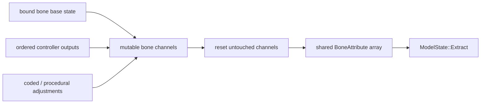

# Processor 与骨骼输出

`AnimationProcessor` 是 controller 与 renderer 之间的合成层。它维护模型基准 snapshot、active bone 与复位状态，依次运行 controller，并写入 `AnimatedGeoModel` 的 `BoneAttribute` 数组。这里的 active bone 是仍受动画或复位驱动的骨骼，不等同于 Extract 产生的可见 render-bone 集。

## 处理流程

绑定阶段按 `BakedModel` 的骨骼 preorder 建立稳定映射，使 Java attribute 与 native hierarchy 使用同一顺序。动画资源绑定及其 Java cache 不是 renderer 的 geometry bake，也不能替代 `BakedModel`。

一次更新按以下逻辑完成：

1. 取得当前模型基准和上次连续状态，确定本次逻辑时间。
2. 按稳定顺序运行 controller，并在各自 player 内完成采样和混合。
3. 按稳定顺序把 controller 结果合成到对应骨骼通道；冲突结果受各 controller 的 blend 与 transition 进度共同影响，不是简单覆盖。
4. 对本次未驱动的通道执行渐进复位，形成完整 attribute 集。
5. 正常路径逐骨骼提交到共享 attribute 数组，再由所选输出槽同步 Extract；Java 求值当前没有事务式 staging、回滚或模型 revision 复核。

## `BoneAttribute`

| 通道 | 逻辑含义 |
|---|---|
| `rotation` | 已包含模型初始旋转的最终局部旋转 |
| `position` | 相对模型基准的局部动画位移 |
| `scale` | 局部缩放 |
| `cubes_hidden` | 隐藏当前骨骼的几何与 locator，不必隐藏后代 |
| `children_hidden` | 保留当前骨骼，但跳过后代层级 |
| `locator_sequence` | 绑定时写入的静态 locator 标记，用于 Extract 选择附着点输出 |

`BoneAttribute` 只表达局部骨骼语义，不包含最终 position / normal matrix、可见面、顶点偏移或 GPU 状态。层级组合、非法数值处理和可见性遍历由 [Extract](../rendering/frame-execution.md) 统一完成。

## Native 交接

`AnimatedGeoModel` 持有 `entity` 级 `BoneAttribute` 数组；各输出槽由 `GeoModelState` 持有 native `ModelState` 和 Java locator mapping，并借用 Extract 返回的只读 `BonePoseView`；`GeoRenderData` 再组合该状态与本次 draw metadata。`GeoModelState.extract(...)` 到 `ModelState::Extract` 是同步边界：native 临时读取 attribute，在 `ModelState` 内生成 `BonePose`、可见骨骼、locator indices 和 `RenderSchedule`，但不保留 attribute 或修改动画状态。

同一 `entity` 的所有 `RenderContext` 求值必须串行；每个输出槽的 Extract、Render、换模与释放也必须串行。`renderer::Render` 还受进程级不可重入资源约束，不能因槽位不同而并发。Extract 的状态发布、失败失效、locator 回传与 `BonePoseView` 借用规则见[逐帧状态与调度](../rendering/frame-execution.md)。

跨语言数据布局是内部实现契约，应由单一版本门禁和测试保持一致，不应写入公开 Model Schema。当前属性语义和 context 复用仍有已知偏差，见[动画已知问题](../../status/known-issues/animation.md)。
