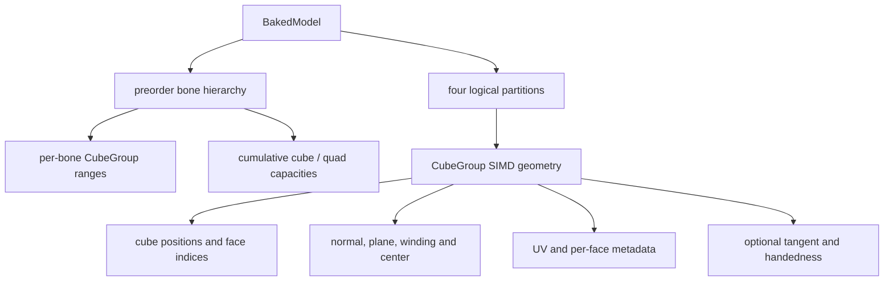

# Bake、分区与 cache

`BakeModel` 将公开几何与基础纹理中稳定的事实转成 CPU renderer 可直接消费的不可变 `BakedModel`。它不上传纹理，不计算动画，也不决定本帧是否可见。

## 三种表示

| 表示 | 用途 | 稳定性 |
|---|---|---|
| Model Schema geometry | 跨实现交换模型语义 | 公开标准 |
| runtime `BakedModel` | 当前进程按所选 SIMD 能力组织的只读热数据 | 内部运行时对象 |
| serialized baked cache | 校验后重建 `BakedModel` 的磁盘派生物 | 机器与 renderer ABI 相关，可删除 |

Serialized cache 不是 runtime 内存映像、Model Schema 或 GPU buffer 格式。其兼容身份必须覆盖平台、native ABI、bake 版本、SIMD capability、模型与资源身份、基础纹理内容、UV 约定和烘焙选项。

## 核心数据关系

`BakedModel` 以稳定 preorder 保存骨骼，使 parent 总在 child 之前，并记录 subtree range 以支持整棵跳过。每个 `CubeGroup` 只属于一个骨骼和一个逻辑分区，是烘焙、调度和批量处理的共同单位；分区范围与累计容量允许 `RenderSchedule` 直接计算工作量。

## 烘焙流程

```mermaid
flowchart LR
    I["decode and validate geometry"] --> H["validate hierarchy and build preorder"]
    H --> U["normalize versioned UV semantics"]
    U --> A["sample base-texture alpha"]
    A --> F["derive static face data"]
    F --> P["classify logical partitions"]
    P --> G["pack SIMD geometry groups as AoSoA"]
    G --> C["build cumulative capacities"]
    C --> O["BakedModel or serialized cache"]
```

`BakeModel` 校验几何与骨骼层级，并为多个 root 生成稳定 preorder 与原顺序映射；cache read 再次验证内部结构。未闭环的校验见[渲染已知问题](../../status/known-issues/rendering.md)。

UV 先按来源版本转换为最终采样语义，再参与 alpha 分类和 tangent 计算。每个 face 保留模型提供的 normal，不从 vertex winding 重新推导；同时预计算中心、平面常数和几何绕序符号，供 render 判断背面与透明深度。空面通常丢弃。完整六面 cube 会识别正常或反向几何；反向 cube 用于只显示背面或描边一类效果，不能被改写成普通外向 cube。

## 四逻辑分区

分区由透明语义与 native 面剔除两个轴组成。`cutout` 是历史内部名称，在这里表示 opaque，不等同于纹理 cutout；四个名称也不决定 Java 的 `RenderType`。

| 分区 | Alpha / 几何语义 | Render 行为 |
|---|---|---|
| `cutout` | 完全不透明且可安全按完整 cube 处理 | 背面剔除，直接写 opaque region |
| `cutout_no_culling` | 完全不透明，但几何不满足安全剔除条件 | 保留正反面，直接写 opaque region |
| `translucent` | UV 覆盖透明洞、部分 alpha，或被强制归入透明 | 保留正反面，写透明临时区 |
| `translucent_culling` | 透明类几何中显式允许剔除或具有反向完整 cube 语义 | 背面剔除，写透明临时区 |

Alpha 分类只读取基础 RGBA 纹理的相关 UV 区域：全透明面可删除；二值透明和部分 alpha 进入透明分区，全不透明进入 opaque 分区。`BakeModelOptions` 控制版本化 UV、PBR tangent 与强制分区，但不改写原始 normal、UV 或 winding；PBR 图片仍由 Java 与 Iris 管理。

## Tangent 与几何语义

PBR tangent 在最终 UV 上由 face 几何与 UV 梯度预计算，保存方向与 handedness；退化 UV 产生确定性结果。Render 再按最终变换修正方向、镜像和背面 handedness；Bake 不预设本帧 model matrix。

Blockbench 一致性在此阶段体现为：不重排 authoring face 语义，不用重算 normal 覆盖显式输入，不丢弃无法证明为不可见的面，并保留负尺寸或反向 cube。平台 shader、光照与混合差异仍可能造成最终像素差异，因此这不是逐像素一致承诺。

## AoSoA 与能力相关布局

每个 `CubeGroup` 将 position、normal、plane、winding、center 和可选 tangent 按分量拆成 SIMD lane 数组；UV、face index 和每个 cube 的 quad 元数据仍按逻辑 face 组织。组内 padding 只是对齐容量，不是额外几何；`RenderSchedule` 不得拆分该组。

进程启动时选择一个受支持的 SIMD 能力，Bake、cache read、transform 和 vertex writer 必须使用同一选择。不同宽度可以拥有不同 group 容量与 padding，因此 serialized cache 只能在匹配的能力键下复用。GPU 方向见[独立设计](../../future/gpu-compute-renderer.md)。
