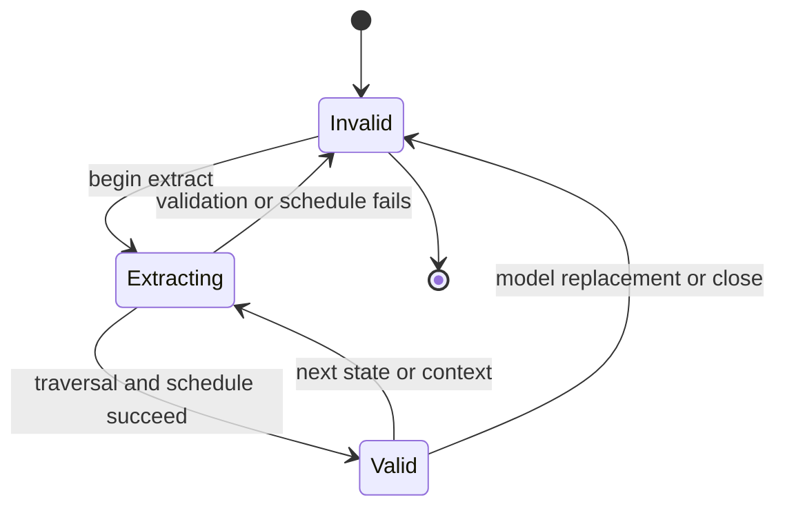
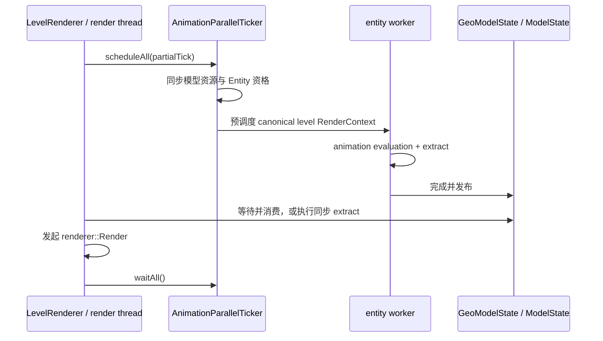
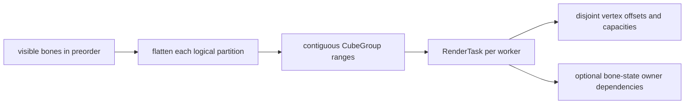

# 逐帧状态与调度

`GeoModelState.extract(...)` 调用 `ModelState::Extract`，把 Java [`AnimationProcessor`](../animation/processor-and-bone-output.md) 已求值的 `BoneAttribute` 转成可供一次或多次 draw 消费的逐帧状态，并在可见工作集变化时生成 `RenderSchedule`。`GeoModelState` 拥有这份结果；Extract 不生成顶点，也不运行 render worker。

## 输入、输出与状态

| 对象 | 内容与所有权 |
|---|---|
| `BoneAttribute` | `AnimatedGeoModel` 的实体级求值结果；Extract 期间只临时读取，通道语义见[骨骼输出](../animation/processor-and-bone-output.md) |
| `BonePose` 与视图 | Native `ModelState` 持有连续 `BonePose` 数组并在 Extract 时写入；成功后 Java 通过只读 `BonePoseView` 借用其中的 pose、normal 与缩放派生字段 |
| frame state | `GeoModelState` 拥有 native `ModelState`；后者共享 `BakedModel`，并保存 `BonePose`、可见骨骼、`RenderSchedule` 与有效标记 |
| locator result | Native 临时暂存并复制 active locator 骨骼索引；Java 结合本次 Extract 返回的 `BonePoseView` 构建 locator 映射 |
| `RenderSchedule` | 当前可见骨骼和 worker 数对应的只读计划；由 `RenderTask` 描述工作与输出范围 |

`GeoModelState.extract(...)` 开始先使旧状态和借用视图失效；只有 `BoneAttribute`、locator 容量、`ModelState::Extract` 层级遍历和调度全部成功后才整体发布为有效。失败不能继续消费上一帧结果。成功的 `ModelState` 会共享持有 `BakedModel` 并拥有 `BonePose` 数组，但不保留 `BoneAttribute`；`GeoModelState` 只借用 Extract 返回的只读 `BonePoseView`。后续 Extract 可以复用或重分配 native 数组，因此旧视图只在下次 Extract 或 close 前有效；覆盖、换模或释放都必须发生在此前 Extract 与 Render 完成之后。

## 层级遍历与可见性

骨骼按 `BakedModel` 的稳定 preorder 单次遍历，用可复用 pose stack 组合 parent pose、pivot、位移、ZYX rotation、scale 与反 pivot。Pivot 与 `BoneAttribute.position` 在此按模型单位转换；baked cube position 不由 Extract 统一缩放。Position 与 normal pose 分开维护；非有限属性、零 scale 或非有限结果会跳过整棵 subtree。

- 隐藏当前骨骼几何只影响该骨骼及其附着点；child 继续遍历。
- 隐藏子级会保留当前骨骼自身，再利用 subtree range 跳过全部后代。
- 只有未隐藏且实际拥有几何的骨骼进入 render bone 序列；正常生产路径由 preorder 构造，因此稳定且唯一。
- 附着点供 Java 原版 layer 使用；`locator_sequence` 只标记需要回传的 active bone。`ModelState::Extract` 返回对应 bone indices 和 `BonePoseView`，`GeoModelState` 将二者组合成 locator mapping，不复制 pose records。

## Java 预调度与 context

Java `RenderContext` 表示会影响动画、姿态或 pass 的调用环境，并决定状态是否可复用；“可复用”与“是否在 worker 执行”是两个维度：

| 路径 | 状态语义 | Extract 位置 |
|---|---|---|
| `level` entity 且满足预调度资格 | canonical `immutable`；同一逻辑帧可供多个兼容 pass 复用 | Java worker，render 时按需等待 |
| `level` entity 但未预调度 | 同样可以是 `immutable` | 渲染线程同步执行 |
| `inventory`、`paperDoll` 或 `firstPersonMod` | mutable；每次重新求值，不覆盖 canonical 槽 | 渲染线程同步执行 |
| 本地第一人称 `irisShadow` | 强制 mutable，避免复用第三人称状态 | 渲染线程同步执行 |
| GUI preview `Entity` | `immutable` 只表示同帧复用；当前未进入预调度集合 | 渲染线程同步执行 |

同一 `entity` 启动新 worker、换模或释放前必须等待已有任务结束。Worker 完成与 render 消费通过任务完成关系和内存栅栏发布；当前不是 lock-free 双缓冲。Render 始终由 Minecraft 渲染线程发起。

## `RenderSchedule`

`RenderSchedule` 只在 `BakedModel` 身份、`ParallelExecutor` worker 数或可见骨骼序列变化时重建；单纯 pose 变化可复用。四个分区先按稳定骨骼顺序、再按骨骼内 `CubeGroup` 顺序展平，随后以不可拆分的 `CubeGroup` 为单位切成连续 `RenderTask` range。

`RenderSchedule` 保存顶点容量、透明区间和任务；每个 `RenderTask` 分区指定 `CubeGroup` 与 vertex 的固定范围。Opaque 分区在前，透明分区接在尾部；剔除留下的容量清零，以保持 task offset 稳定。

当前分配按 `CubeGroup` 数近似均衡，而不是按 quad、PBR、剔除结果或真实指令成本估算。它优先保证确定性、连续访问和无共享 append；复杂分布仍可能产生尾部不均衡。

## `RenderSchedulingMode`

`RenderSchedule.mode` 选择以下执行方式：

| 模式 | 适用逻辑 | 同步方式 |
|---|---|---|
| `RenderSchedulingMode::kInline` | 单 worker 或小工作集 | 调用线程完成 `RenderBoneState` 与全部顶点任务 |
| `RenderSchedulingMode::kSerialLateWake` | 并行收益有限但仍值得分担顶点工作 | 调用线程先准备全部 `RenderBoneState`，再发布任务并唤醒 worker |
| `RenderSchedulingMode::kSerialPrewake` | 较大顶点工作，串行骨骼准备仍较短 | 先预唤醒 worker；调用线程准备 `RenderBoneState`，随后发布顶点任务 |
| `RenderSchedulingMode::kWorkerReadySpin` | 骨骼与 `CubeGroup` 均足够多 | worker 准备连续骨骼区间并发布 ready；任务只等待其依赖 owner |

具体阈值是性能调优参数，不属于架构契约。`kWorkerReadySpin` 以一个 worker 所拥有的整段骨骼状态为粒度，而不是每骨骼 flag；消费者只等待实际依赖，避免全局阶段屏障。

## 低延迟同步与并发边界

`ParallelExecutor` 是进程级常驻 worker pool，调用线程同时承担 worker 0。桌面策略可在 active render scope 中短暂预唤醒或自旋；Android 优先阻塞等待。任务与 ready 状态通过 release / acquire 发布，结束时统一建立完成可见性。

每个 `RenderTask` 只写自己的 vertex range；worker 可并行读取 `BakedModel` 和已发布 pose。当前 `ParallelExecutor`、透明 scratch、`VertexConsumer` fallback 与 draw-matrix scratch 要求 `renderer::Render` 全局串行；同一 `ModelState` 的 Extract 与 Render 也不得并发。不同 `entity` 的 Java 动画求值与 Extract 可以并行，Extract 不属于 render worker 工作。
