# CPU render 与顶点输出

`renderer::Render` 消费有效的 `ModelState`、`RenderParameters`、`VertexKind` 和输出区间，生成 Minecraft 可上传的顶点。`NativeRenderAdapter` 选择 direct 或 `VertexConsumer` fallback；native 负责 `RenderBoneState`、面语义与字节写入。

## 主流程

```mermaid
flowchart LR
    RT["RenderType"] --> MS["MultiBufferSource"]
    MS --> VC["VertexConsumer"]
    VC --> J["NativeRenderAdapter"]
    J --> P["select VertexKind<br/>reserve output region"]
    P --> B["build RenderBoneState"]
    B --> W["execute RenderTask partitions"]
    W --> C["transform and cull faces"]
    C --> O["write opaque region"]
    C --> T["write translucent scratch + depth"]
    T --> S["global far-to-near sort for this model draw"]
    S --> F["copy translucent tail"]
    O --> K["commit to VertexConsumer on success"]
    F --> K
    K --> D["Minecraft upload and draw"]
```



Java 完成 `entity` 姿态补偿、模型缩放、纹理与 `RenderType` 选择；`NativeRenderAdapter` 再把 draw 矩阵、context、光照、overlay、颜色和 Iris entity data 适配为 `RenderParameters`。纹理像素与 GPU 句柄不传给 native。

## 变换与面语义

每个可见骨骼先形成一份 `RenderBoneState`：最终 position 变换、normal 变换、投影后面朝向系数、light，以及透明面需要的 depth 变换。Position、normal 与 clip-space 变换必须分别从上层提供的正确矩阵组合，不能从单一 4×4 matrix 猜测全部语义。

Face 在 Bake 已保存 normal、plane、winding 和 center。Render 用最终 clip transform 判断其投影后朝向，而不是使用简单的相机方向点积：

- culling 分区丢弃 back face；double-sided 分区保留它，并反转输出 normal；
- 反向 cube 沿用其 baked winding，因此保持只显示背面一类 authoring 语义；
- 透明 depth 使用变换后 face center 的 NDC 深度，与顶点任务使用同一姿态；
- 非有限输入矩阵或骨骼变换使 Render 失败；无效方向归零，非有限透明 depth 使用 invalid sort key。

Normal 使用上层 normal matrix 与骨骼 normal pose 的组合；非均匀缩放等非保角变换在打包前归一化，Vanilla 与 Iris direct 输出均采用该规则，back face 再反转 normal。校验与 fallback 偏差见[渲染已知问题](../../status/known-issues/rendering.md)。

PBR tangent 在最终 position / normal 语义下变换；非保角路径单独归一化，镜像、骨骼 determinant 与 back face 共同修正 handedness。无 PBR 时扩展格式写确定的零 tangent，不使用未初始化数据。

## `RenderType`、`renderer::RenderContext` 与 `VertexKind`

一次模型 draw 中的三者是正交维度：`RenderType` 决定 Minecraft draw state 与目标 `VertexConsumer`，`renderer::RenderContext` 是 Java `RenderContext` 的三值投影，`VertexKind` 只选择 native 顶点布局。Iris shadow 因而不是一种 `VertexKind`。

| 输出路径 | 选择条件 | 交接语义 |
|---|---|---|
| Vanilla direct | `VertexConsumer` 提供 `VertexBufferAccessor`，布局为 `DefaultVertexFormat.NEW_ENTITY` | Native 写连续区域，包含 position、color、UV、overlay、light、normal |
| Iris direct | accessor 可用且 Iris layout 已识别 | Native 按对应版本写 entity data、mid-UV、tangent 等扩展语义 |
| `VertexConsumer` fallback | accessor 不可用或 layout 未识别 | Native 生成中间顶点，Java 逐顶点回放到原 `VertexConsumer` |

Direct 路径预留连续区域并只在 native 成功后提交；fallback 也只在成功后回放，不产生部分模型顶点。失败降级缺口见[渲染已知问题](../../status/known-issues/rendering.md)。

## 顶点输出区间与 translucent 排序

最终逻辑布局为：

```text
[cutout][cutout_no_culling][translucent + translucent_culling tail]
```

`cutout` 与 `cutout_no_culling` 的 `RenderTask` 直接写固定区间；`translucent` 与 `translucent_culling` 先写临时区并记录每个 quad 的 face-center depth，全部任务完成后按本次模型 draw 全局远到近排序，再复制到预留尾部。剔除留下的未写容量会清零并标记 invalid；depth 非有限的已写 quad 保留并排到末尾。

Iris shadow 不执行透明排序，保持生成顺序。当前排序范围只覆盖一次模型 draw，跨实体、跨模型和跨 draw 的混合顺序仍由 Minecraft 上层管线决定。Java 外层关闭模型局部 culling 与 upload-time sorting 的重复处理，使 native 的面剔除与单模型透明排序成为唯一来源；但 Java 是否选择真正的 translucent pass 仍会影响最终混合效果。

## SIMD 分派

进程级能力选择必须与烘焙布局一致；分派只改变 lane 数、批量计算和指令选择，不能改变分区、背面、normal / tangent、顶点语义或透明排序结果。布局与 cache 约束见 [AoSoA 与能力相关布局](bake-and-partition.md#aosoa-与能力相关布局)。
