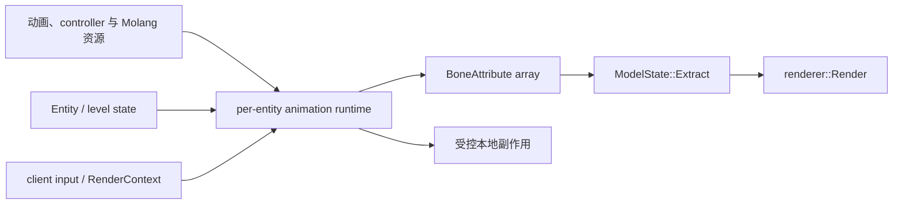

# 动画系统

YSM 的动画系统在客户端把 `Entity` / `level` 状态、客户端输入、`RenderContext` 和模型动画资源求值为逐骨骼 `BoneAttribute`，再交给 native renderer 执行 extract 和 render。Java 拥有动画语义与每 `entity` 运行时；native 不解析动画、controller 或 Molang。

## 设计目标

- 让模型动画、内建动作和标准化输入进入同一套可组合的骨骼求值流程；
- 分离模型级只读资源、`entity` 级可变状态、逐次 `RenderContext` 和 native 逐帧输出；
- 支持 coded、Bedrock 与 hybrid controller，同时保留确定的状态转换、混合和覆盖顺序；
- 允许常规 `level` 中的 `entity` 提前求值，且不让异步执行破坏其生命周期或重复触发副作用；
- 把持久变量与瞬时动作分开，不让外部输入承担模型身份或资源所有权；
- 将模组联动限制为输入适配，不让可选依赖侵入动画状态机或 renderer 生命周期。

## 主链

`BoneAttribute` 只描述骨骼局部旋转、位移、缩放、层级可见性和 locator 标记；最终层级变换、可见几何、调度与顶点生成属于[渲染系统](rendering.md)。模型资源的 wire 结构以 [Model Schema](../standards/model-schema/assets-and-validation.md) 及其 Proto 快照为准。

详细职责、状态与求值过程见[动画架构](../architecture/animation/README.md)。当前线程安全、语义完整性、联动模组和实机验证缺口见[动画已知问题](../status/known-issues/animation.md)。
