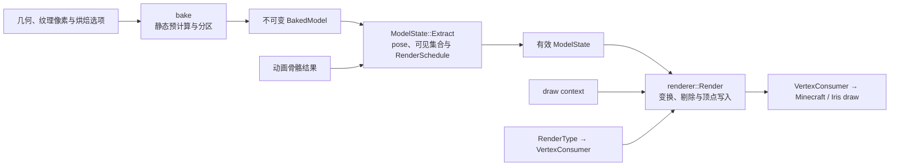

# 渲染系统

YSM 当前使用 native CPU renderer，将静态模型处理、逐帧状态更新和顶点输出拆为 bake / extract / render 三阶段。Java 负责模型、纹理、[动画求值](animation.md)、`RenderType`、`VertexConsumer` 与资源生命周期；native 负责烘焙、提取、调度和顶点生成；Minecraft 最终上传并 draw。YSM `BakedModel` 及其磁盘 cache 都是内部派生格式，不属于 [Model Schema](../standards/model-schema/README.md)，也不是 Minecraft 同名类型。

## 设计目标

- 把静态分析和数据整理前移到 bake，使 extract 只形成逐帧状态，render 只处理本次 draw；
- 允许 `level` entity 主路径提前求值和提取状态，小负载避免调度开销，大负载并行生成顶点；
- 以 Blockbench 预览效果为视觉基准，在平台与渲染管线约束内尽量保持姿态、面朝向、UV、材质和透明表现一致；
- 以同一几何语义适配 Vanilla、Iris 和通用 `VertexConsumer` fallback，优化不能牺牲可见面、UV、法线、切线或透明层次的正确性；
- 保持三阶段语义稳定，同时允许 CPU 数据布局和执行策略继续替换。

## 三阶段管线

`BakeModel` 构建 `BakedModel`；`ModelState::Extract` 形成逐帧可见状态与 `RenderSchedule`；`renderer::Render` 通过 direct 或 `VertexConsumer` fallback 输出顶点。这些名称均为内部契约。

详细流程、数据与线程契约见[渲染架构](../architecture/rendering/README.md)。尚未实现的 GPU 方向见 [GPU Compute Renderer](../future/gpu-compute-renderer.md)。
