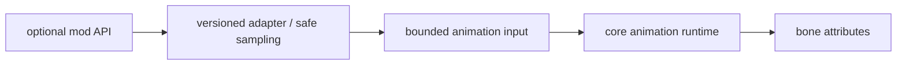

# 模组动画联动

当前主线仍保留若干直接模组联动，但尚未按统一边界改造和验收；大量目标也未迁入。任何 adapter 只有满足本页验收条件后才能列为正式支持；本页定义后续收敛边界，不是支持列表。

## 适配边界

每个 adapter 只负责把可选模组状态投影为有限的动画输入，例如 Molang query、controller predicate、标准化动作状态或 render-context hint。Adapter 不得拥有动画状态机、持有 renderer 资源，也不得让模组类型泄漏到核心 animation / processor 接口。

主线程限定或非线程安全的 API 必须在安全阶段采样，再把不可变值交给动画 worker。可选依赖应独立加载、检测版本并隔离失败；缺少模组、版本不匹配或 adapter 异常时退回核心动画，不影响模型加载与基础渲染。

## 候选范围

覆盖面分为战斗与武器、移动与载具、实体/装备与渲染三类；接入顺序按 API 稳定性、用户覆盖面和对核心边界的侵入程度决定。

## 宣称支持的条件

- 明确支持的模组与游戏版本，缺少依赖时无 class-load 或注册失败；
- 不同来源的实体使用一致的标准化动画语义；
- 异步动画路径不直接调用主线程限定 API，adapter 失败可隔离；
- 完成核心动作、模型切换、重连、第一/第三人称和相关 render pass 的实机功能与视觉测试；
- 将仅供输入的联动与真正改变渲染 layer 或骨骼附着的扩展分别评审。

在满足这些条件前，任何具体模组都应标记为未支持。
